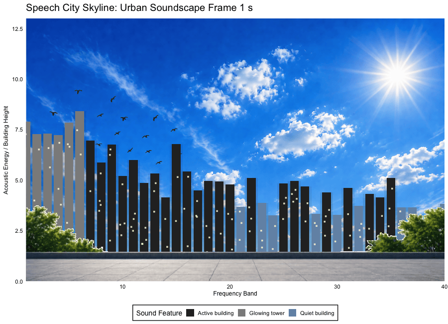

## Speech City: Visualizing urban soundscapes as a living city skyline

### Introduction

Urban areas are naturally filled with so many layered sounds like engines, sirens, air conditioners, music , construction, people and also animals. Although we practicall here those sounds through hearing, they contain structure that we can represent visually as well. A sound signal or a waveform changes over time, and the different parts of that signal/waveform actually carry energy at different frequencies. This concept is called a "spectrogram" in science. But as intended for this project, I wanted to move towards a more creative visualization for this rather than a traditional scientific plot.

In this, I try to transform this invisible structure of urban sound in to a living skyline gif. The idea is based on the fact that a city can be built from its sounds!

For this I use real urban audio recordings from the `UrbanSound8K` dataset, (<https://www.kaggle.com/datasets/chrisfilo/urbansound8k>) and select recordings from each urban sound class and mix them into a composite soundscape.

This dataset contains meta-data information about every audio file in the dataset. This includes:

-   `slice_file_name`: The name of the audio file

-   `fsID`: The Freesound ID of the recording from which this excerpt (slice) is taken

-   `start`: The start time of the slice in the original Freesound recording

-   `end`: The end time of slice in the original Freesound recording

-   `salience`: A (subjective) salience rating of the sound. 1 = foreground, 2 = background.

-   `fold`: The fold number (1-10) to which this file has been allocated.

-   `classID`: A numeric identifier of the sound class

And then I convert that sound into a time- frequency-energy representation. Frequency bands become building positions, acoustic energy becomes building height and time becomes the animation.The goal is to provide a creative way to visualize hidden acoustic structure of an urban environment.

### **Visual Mapping**

**The visualization is based on a metaphor: acoustic structure becomes architecture. Instead of showing the sound as a traditional spectrogram, I map the sound onto a city skyline.**

| Audio feature | Visual element | Meaning |
|------------------------|------------------------|------------------------|
| Frequency band | Building position along the x-axis | Lower to higher frequency regions of the sound |
| Acoustic energy | Building height | Stronger sound energy creates taller buildings |
| Time | Animation frame | The city changes as the sound changes |
| High energy bands | Glowing towers | Dominant frequency regions in the soundscape |
| Moderate energy bands | Active buildings | Noticeable but less dominant sound components |
| Low energy bands | Quiet buildings | Background or weaker parts of the sound |

This mapping makes the soundscape easier to understand visually. Instead of reading a spectrogram, the viewer watches an urban skyline grow and shift in response to the acoustic energy of the city sounds.

### Installing and loading required packages

I will first install following packages for audio processing, data wrangling, image layering, plotting, and animation.

The new packages I identified while working on this are: `tuneR` package which reads and writes audio files, `seewave` which creates the spectrogram, and `gganimate` which turns the static skyline into a moving visualization.

```{r}
# install.packages("tuneR")
# install.packages("seewave")
# install.packages("gganimate")
# install.packages("gifski")
# install.packages("png")
# install.packages("grid")
# install.packages("scales")

library(tidyverse)
library(tuneR)
library(seewave)
library(gganimate)
library(gifski)
library(png)
library(grid)
library(scales)
```

### Loading the UrbanSound8K metadata

The UrbanSound8K metadata file contains information about each sound file, including its class, fold number, and file name. I use this metadata to locate the audio files and select one representative sound from each class.

```{r}
# Reading the UrbanSound8K metadata file

meta_data <- read.csv("data/UrbanSound8K/UrbanSound8K.csv")
```

```{r}
# First I want to check the sound classes available in the dataset

unique_classes <- unique(meta_data$class)
print(unique_classes)
```

There are 10 different sound classes in the dataset.

### Selecting one sound from each urban sound class

To create a balanced urban soundscape, I selected one audio file from each of the ten sound classes. This prevents the final mix from being dominated by one type of sound and makes the composite soundscape represent the full variety of the dataset.

```{r}

set.seed(123)

# Selecting one audio file from each of the ten sound classes

sample_files <- meta_data %>%
  group_by(class) %>%
  slice_sample(n = 1) %>%
  ungroup() %>%
  mutate(
    path = file.path(
      "data/UrbanSound8K/audio",
      paste0("fold", fold),
      slice_file_name
    )
  )

# The selected files and their paths

sample_files %>%
  select(class, slice_file_name, path)
```

Above, we can see this way we can pick random 10 sounds from each class from the dataset.

-   **One important thing since the initial data processing part involves combining audio files together and it contains accessing different audio files based on the read CSV file randomly from each class, I have not included the whole data set which contains the audio files to the github. instead, i uploaded a sample from each fold to the github, so that someone can replicate this visualization without a storage burden.**

But, since the storage requirements are high for all the audio files, i included sample audios from each class inside folds randomly and I am giving following replication easy paths for the user.

```{r}
sample_files_for_replication <- c(
  "data/UrbanSound8K/audio/fold0/177726-0-0-30.wav",  # air_conditioner
  "data/UrbanSound8K/audio/fold1/199769-1-0-7.wav",   # car_horn
  "data/UrbanSound8K/audio/fold2/187110-2-0-8.wav",   # children_playing
  "data/UrbanSound8K/audio/fold3/147672-3-1-0.wav",   # dog_bark
  "data/UrbanSound8K/audio/fold4/78360-4-0-2.wav",    # drilling
  "data/UrbanSound8K/audio/fold5/39856-5-0-9.wav",    # engine_idling
  "data/UrbanSound8K/audio/fold6/145683-6-3-0.wav",   # gun_shot
  "data/UrbanSound8K/audio/fold7/162134-7-4-0.wav",   # jackhammer
  "data/UrbanSound8K/audio/fold8/156869-8-0-6.wav",   # siren
  "data/UrbanSound8K/audio/fold9/149370-9-0-21.wav"   # street_music
)


```

### Reading and cleaning audio files

The selected audio clips are different in their sampling rate, channel format, amplitude, and duration. So, importantly before mixing them, I want to standardize all recordings. Each file is converted to mono, resampled to 22,050 Hz, normalized to the same amplitude range, and padded or trimmed to four seconds. This makes combining the sounds easy and meaningful for me.

Another important thing was, normalizing each file so no one sound dominates only because it is louder.

```{r}

read_clean_sound <- function(path, target_sr = 22050, target_duration = 4) {
  
  # Reading the wav file
  wave <- readWave(path)
  
  # Resampling audio so all files have the same sampling rate
  
  if (wave@samp.rate != target_sr) {
    wave <- tuneR::downsample(wave, samp.rate = target_sr)
  }
  
  # Converting stereo or multichannel audio to mono
  
  if (inherits(wave, "WaveMC")) {
    samples <- rowMeans(wave@.Data)
  } else if (wave@stereo) {
    samples <- rowMeans(cbind(wave@left, wave@right))
  } else {
    samples <- wave@left
  }
  
  # Now I want to convert samples to numeric values
  
  samples <- as.numeric(samples)
  
  # Normalizing each file so no one sound dominates only because it is louder
  
  maximum_value <- max(abs(samples), na.rm = TRUE)
  if (maximum_value > 0) {
    samples <- samples / maximum_value
  }
  
  # Making every sound the same duration
  
  target_length <- target_sr * target_duration
  
  if (length(samples) > target_length) {
    samples <- samples[1:target_length]
  } else if (length(samples) < target_length) {
    samples <- c(samples, rep(0, target_length - length(samples)))
  }
  
  return(samples)
}
```

### Combining chosen sounds into one urban soundscape

After standardizing the selected recordings, the selected sounds are combined by averaging their waveforms. This creates one composite soundscape that represents multiple types of urban sounds occurring together.This represents a single real-world recording. It creates an imagined urban acoustic scene that contains elements from all ten sound classes. This mixed sound becomes the basis for the skyline.

```{r}

sample_files

# Now let's use the function I defined above to read and clean all selected audio files

signals <- map(
  sample_files_for_replication,
  read_clean_sound,
  target_sr = 22050,
  target_duration = 4
)

# Averaging the signals to create one combined urban soundscape

combined_signal <- Reduce("+", signals) / length(signals)

# After that, normalizing final combined signal

combined_signal <- combined_signal / max(abs(combined_signal), na.rm = TRUE)

# Convert to 16-bit audio format

combined_signal_16bit <- as.integer(combined_signal * 32767)

# Creation of a wave object from the combined signal

combined_wave <- Wave(
  left = combined_signal_16bit,
  samp.rate = 22050,
  bit = 16
)

# Saving the combined soundscape, This will be saved to the main folder of "Creative_data_vislauzation"

writeWave(combined_wave, "combined_urban_soundscape.wav")
```

### Converting sound into a spectrogram

**Someone who wants to run this visualization can start from this point if needed, because I am saving the combined soundscape in the previous step and its been read here in below code. Since here I will be accessing the combined soundscape to build my data set containing it's time, frequency, energy features. So basically, anyone can and move forward with the visualization from here onwards, without accessing the audio files too.**

To build the city from sound, I first convert the mixed audio into a spectrogram. A spectrogram shows how acoustic energy changes across time and frequency. This step is one of my critical steps because the final visualization uses the same three dimensions which are time, frequency, and energy.

```{r}
# Creating spectrogram without plotting it directly

spectrogram <- spectro(
  combined_wave,
  plot = FALSE,
  wl = 512,
  ovlp = 75
)

# Extracting amplitude, frequency, and time information

amplitude <- spectrogram$amp
frequency <- spectrogram$freq
time <- spectrogram$time
```

### Reshaping the spectrogram into tidy data

The spectrogram is stored as a matrix table, but I want to turn this into long-format. I convert the spectrogram into a tidy data frame where each row represents one time-frequency-energy observation.

```{r}
# Converting the amplitude matrix to a data frame

spectrogram_df <- as.data.frame(amplitude)
spectrogram_df$freq <- frequency

# Converting from wide matrix format to long tidy format

sound_data <- spectrogram_df %>%
  pivot_longer(
    cols = -freq,
    names_to = "time_index",
    values_to = "energy"
  ) %>%
  mutate(
    time_index = as.numeric(gsub("V", "", time_index)),
    time_sec = time[time_index],
    energy = as.numeric(energy)
  )
```

### Now, transforming acoustic data into city data

Now, I want to convert this sound data into my visual building data. Frequencies up to 8 kHz are divided into 40 frequency bands. As described above, each band becomes a building position. Energy values are averaged within each time-frequency band and rescaled to create building heights.

```{r}

speech_city <- sound_data %>%
  filter(freq <= 8) %>%
  mutate(
    
    # As mentioned above I need to divide the frequency range into 40 building positions
    
    frequency_band = as.numeric(cut(freq, breaks = 40))
  ) %>%
  group_by(time_index, frequency_band) %>%
  summarise(
    
    # Averaging energy within each time-frequency building
    
    energy = mean(energy, na.rm = TRUE),
    .groups = "drop"
  ) %>%
  mutate(
    
    # Rescaling energy so it works visually as building height
    
    energy_scaled = scales::rescale(energy, to = c(0, 10)),
    
    # Classifying buildings by acoustic energy level
    
    sound_type = case_when(
      energy_scaled > 7 ~ "Glowing tower",
      energy_scaled > 4 ~ "Active building",
      TRUE ~ "Quiet building"
    )
  )
```

I wanted to check whether

```{r}
summary(sound_data$energy)
summary(speech_city$energy_scaled)
```

### Making the visualzation more natural

#### Adding windows and atmospheric effects

To make the skyline look more like a city, I added small square windows to the buildings. The windows are placed only on buildings with enough height to hold them.

```{r}

# Creating small square windows for visible buildings

window_data <- speech_city %>%
  filter(energy_scaled > 2) %>%
  slice(rep(1:n(), each = 4)) %>%
  mutate(
    window_x = frequency_band + runif(n(), -0.25, 0.25),
    window_y = runif(n(), 0.4, energy_scaled - 0.2)
  )

```

I was planning to create a light cloud layer that represents the overall activity of the soundscape at each time frame using cloud emojis. But, then i decided to go with a natural background for this skyline representation without adding the fog_data or the atmospheric effects.

```{r}

# Creating a simple atmospheric cloud layer based on average sound activity

fog_data <- speech_city %>%
  group_by(time_index) %>%
  summarise(
    fog_level = mean(energy_scaled, na.rm = TRUE),
    .groups = "drop"
  ) %>%
  mutate(
    x = 20,
    y = 11,
    label = case_when(
      fog_level > 5.5 ~ "☁️ ☁️ ☁️",
      fog_level > 4.5 ~ "☁️ ☁️",
      TRUE ~ "☁️"
    )
  )
```

### Loading background and foreground images

So, now I am going forward with background and foreground images to my visualization for it to look more natural.

The background image creates the sky setting, while the foreground image adds the ground and trees in front of the data-driven buildings. These images help turn the plot from a standard bar chart into a city scene.

```{r}
# Reading  background and foreground images

bg <- readPNG("images/city_background.png")
fg <- readPNG("images/city_foreground.png")

# Making  black parts of the foreground transparent if needed

if (dim(fg)[3] == 3) {
  fg <- array(
    c(fg, rep(1, dim(fg)[1] * dim(fg)[2])),
    dim = c(dim(fg)[1], dim(fg)[2], 4)
  )
}

black_pixels <- fg[,,1] < 0.05 & fg[,,2] < 0.05 & fg[,,3] < 0.05
fg[,,4][black_pixels] <- 0
fg[,,4][!black_pixels] <- 1
```

### Building the animated skyline

The plot below combines all parts of the visualization. The background sky is drawn first, followed by the acoustic buildings, windows, clouds, and foreground image. The buildings change over time using \`transition_time()\`, creating the effect of a living skyline shaped by the urban soundscape.

```{r}

# I first by adding the background image for my visualzation

p <- ggplot() +
  
  annotation_raster(
  bg,
  xmin = 1, xmax = 40,
  ymin = 0, ymax = 13
) +
  
  
# now I am creating a horizontal base for the buildings to sit on
  
  annotate(
    "rect",
    xmin = -Inf, xmax = Inf,
    ymin = -Inf, ymax = Inf,
    alpha = 0.55,
    fill= NA
  ) +
  
  annotate(
    "rect",
    xmin = -Inf, xmax = Inf,
    ymin = -0.5, ymax = 0.2
  ) +
  
# Adding a soft shadow layer behind buildings so that in creates depth and makes buildings less flat
  
  geom_col(
    data = speech_city,
    aes(x = freq_band, y = energy_scaled),
    fill = "black",
    alpha = 0.08,
    width = 1.2,
    position = "identity"
  ) +

# Here is where my data driven main buildings are drawm. Here, each bar, I am adding as a frequency band, and by height i present acoustic energy and by color i present energy category (quite/active/ dominant(glow)).
  
  geom_col(
    data = speech_city,
    aes(
      x = freq_band,
      y = energy_scaled,
      fill = sound_type
    ),
    width = 0.8,
    position = "identity"
  ) +
  
# Using the window data I created above to add small sqaure points simulating lit windows in buildings. My goal here is to add realism and texture to the skyline.
  
  geom_point(
  data = window_data,
  aes(x = window_x, y = window_y),
  shape=15,
  color = "#FFF8DC",
  alpha = 0.85,
  size = 1.2
) +

# Color mapping for buildings, different energy levels mapped to realistic building tones.
  
  scale_fill_manual(
  values = c(
    "Quiet building" = "#7393B3",    # dark concrete
    "Active building" = "#2B2B2B",   # medium gray building
    "Glowing tower" = "#8C8C8C",     # warm beige/sandstone
    "Spark burst" = "#5A5A5A"        # brown brick
  )
) +
  
  scale_alpha(range = c(0.45, 1), guide = "none") +
  scale_size(range = c(2, 9), guide = "none") +
  
# Defining visible plotting region (city bounds), i want to keep the buildings aligned with background image
  
  coord_cartesian(
    xlim = c(1, 40),
    ylim = c(0, 13),
    expand = FALSE
  ) +
  
# Next I am adding the Foreground layer (ground and few trees), this is specifically placed after buildings so it appears in front
  
  annotation_raster(fg, xmin = 1, xmax = 40, ymin = 0, ymax = 13) +
  
  labs(
    title = "Speech City Skyline: Urban Soundscape Frame {round(frame_time,3)} s",
    
    x = "Frequency Band",
    y = "Acoustic Energy / Building Height",
    fill = "Sound Feature"
  ) +
  
  theme_minimal(base_size = 14) +
theme(
  panel.background = element_rect(fill = "transparent", color = NA),
  plot.background = element_rect(fill = "white", color = NA),
  
  axis.title = element_text(color = "black", size = 12),
  axis.text = element_text(color = "black"),
  
  panel.grid = element_blank(),  # remove grid if you want clean look
  
  legend.position = "bottom",
  legend.background = element_rect(fill = "white"),
  
  plot.title = element_text(size = 20, face = "bold"),
  plot.subtitle = element_text(size = 12)
) +
  
  
# Now, the most important part is adding animations, I needed to animate this in order to visualize time dimension driving how the skyline evolves
  
  transition_time(time_index) +
  ease_aes("sine-in-out")
```

Then, I wanted to check following to make sure I have extarcted the data in to visualization correctly.

```{r}
nrow(window_data)
nrow(fog_data)
nrow(sound_data)
```

I have commented rendering the animation code to avoid re-rendering it and I have below entered a generated .gif of my visualization.

When replicating this locally, anyone can uncomment this below code chunk and generate the animated visualization .gif !!

```{r}

# Rendering the animation, this converts the ggplot object into a GIF that shows how the skyline evolves over time

# animated_gif<- animate(
#   p,
#   
#   # Total number of frames in the animation
#   nframes = 160,
#   
#   # Frames per second (speed of playback)
#   
#   fps = 1,
#   
# # follwoing are the output dimensions of the animation (in pixels)
# 
#   width = 900,
#   height = 650,
# 
# renderer = gifski_renderer("speech_city_skyline.gif")
# )

# animated_gif
```

Reading the generated and saved file from the folder.

```{r}

```

I tried to add maximum number of frames to present a smoother motion. Also, I kept a reasonable frames per second value for human naked eye to visualize the sound features via the skyline slowly.

So, the final visualization is,


